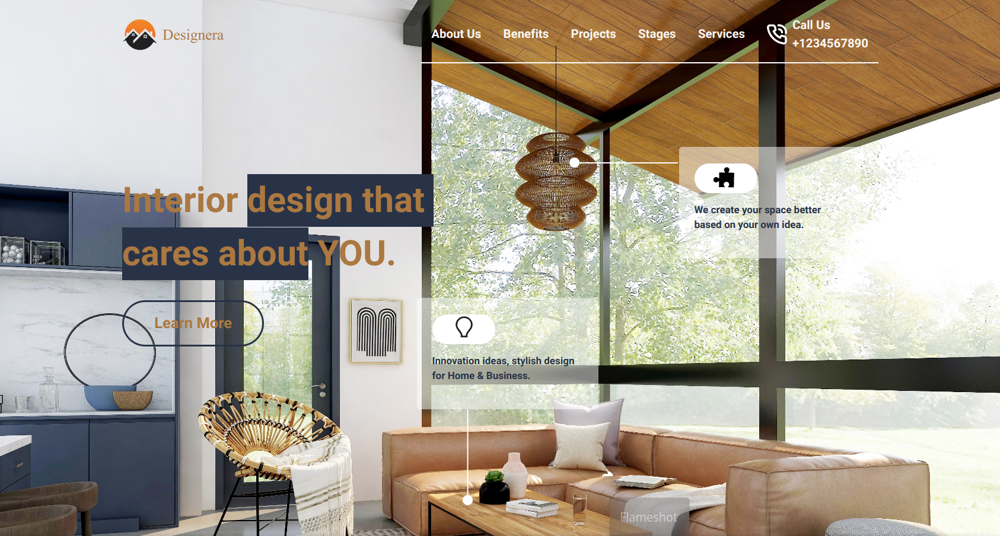

# Interior-Designer

# Interior Designer

> Project 10

<table>
<tr>
<td>
  A landing page designed using pure HTML & CSS.
</td>
</tr>
</table>

### Skills Gained from this

- Boy, oh boy! What an insane build. Learned a lot about ::before, ::after, :not, and of course ::selection.
- Explored CSS Reset by Andy Bell and tried to implement BEM naming convention for CSS classes.
- Tried the CSS variables(partially) and definitely it is a life savor if in future we ever need to change the colors.

### Screenshot

## Device support

The site is compatible with desktop/laptop screens only.

## Author

